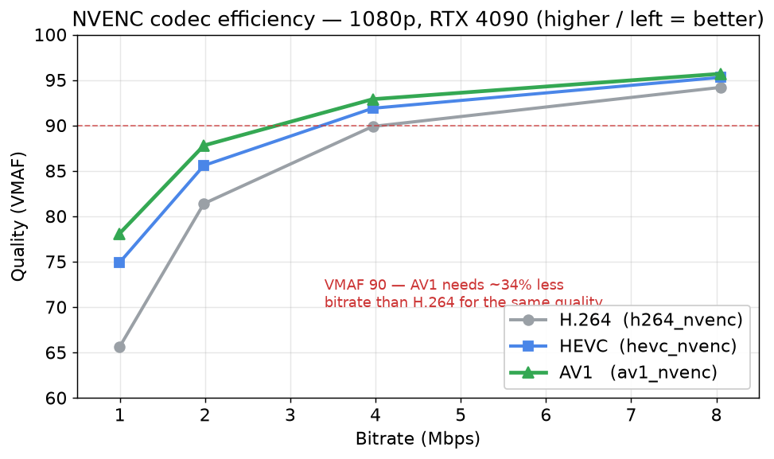

# FFmpeg Plus — NPU‑accelerated FFmpeg

**FFmpeg Plus is an enhanced fork of [FFmpeg](https://ffmpeg.org) (based on release `n7.1.5`) that adds hardware video transcode (NVENC / QSV / AMF + AV1), can offload AI/ML video processing to an NPU (Neural Processing Unit), and improves multi‑core CPU and any‑vendor GPU acceleration.**

Same license as upstream FFmpeg (LGPL v2.1+ / GPL v2+).

> 📦 **Prebuilt Windows x64 package (NPU/DirectML ready):** see the [latest release](../../releases/latest). Unzip and run — `onnxruntime.dll` (DirectML) and `DirectML.dll` are bundled.

---

## 🧠 NPU support — what it is and what it does

Modern PCs (AMD Ryzen AI, Intel Core Ultra, Qualcomm Snapdragon X) ship an **NPU**: a dedicated low‑power chip for neural‑network inference. FFmpeg Plus can run its **DNN filters on the NPU** through **ONNX Runtime + DirectML**.

### What the NPU actually does here

AI video filters (super‑resolution, denoise, detection, …) run a neural network on **every frame**. On stock FFmpeg that inference runs on the **CPU**, which:

- consumes a large amount of CPU time,
- competes with decoding/encoding/filtering for CPU cores,
- heats up the machine and drains battery on laptops.

FFmpeg Plus sends that inference to the **NPU** instead. The result:

- **CPU load drops dramatically** — the heavy matrix math leaves the CPU entirely.
- The freed CPU cores stay available for decode/encode/muxing, so the **whole pipeline breathes easier**.
- **Lower power / heat** — the NPU is built for exactly this work and does it at a fraction of the wattage.

> The NPU is intentionally used for **auxiliary / inference tasks** (the DNN filters), **not** for the core decode/encode path. NPUs are great at steady neural workloads but are not faster than dedicated video hardware for codecs — so FFmpeg Plus keeps codecs on the CPU/GPU video engines and routes only the ML work to the NPU.

### Measured effect (CPU‑offload evidence)

Running the same ONNX filter on a development machine (`-benchmark`):

| Execution provider | CPU time (`utime`) | Wall‑clock (`rtime`) |
|--------------------|-------------------:|---------------------:|
| **CPU**            | **15.1 s**         | 1.19 s |
| **DirectML (NPU/GPU)** | **1.86 s**     | 1.45 s |

CPU time fell from **15.1 s → 1.86 s** — the inference workload moved off the CPU. (On this dev box without an NPU, DirectML used the GPU; on an NPU‑equipped PC the same path targets the NPU. Heavier models also show a wall‑clock win, not just a CPU‑time win.)

### How to use the NPU

```bash
# Generic per-frame DNN processing on the NPU
ffmpeg -i input.mp4 -vf \
  "format=rgb24,dnn_processing=dnn_backend=onnxruntime:model=model.onnx:execution_provider=directml" \
  output.mp4

# NPU super-resolution (2x)
ffmpeg -i input.mp4 -vf \
  "format=yuv420p,sr=dnn_backend=onnxruntime:model=sr.onnx:execution_provider=directml" \
  output.mp4

# NPU object detection (SSD/YOLO models) — writes bounding boxes as frame metadata
ffmpeg -i input.mp4 -vf \
  "dnn_detect=dnn_backend=onnxruntime:model=ssd.onnx:model_type=ssd:confidence=0.5,showinfo" \
  -f null -
```

Filters with `dnn_backend=onnxruntime`: **`dnn_processing`**, **`sr`**, **`derain`/`dehaze`**, **`dnn_detect`**.

Execution providers (`execution_provider=`): `cpu` (always available), `directml` (NPU/GPU on Windows), `cuda`. Pick the NPU adapter with `device_id=N`.

### Confirm the NPU is being used

1. Run with `-loglevel verbose` and look for:
   `ONNXRuntime: using DirectML EP (device 0) for NPU/GPU offload.`
2. Open **Task Manager → Performance → NPU** during the run — utilization should rise.
3. Compare `-benchmark` `utime` between `execution_provider=directml` and `=cpu` — it should drop sharply with the NPU.

> Requires an ONNX Runtime built with DirectML. The prebuilt release bundles it. NPU hardware is needed for true NPU execution; otherwise DirectML runs on the GPU.

---

## 🚀 Hardware video transcode (NVENC / NVDEC / QSV / AMF + AV1)

Full hardware encode/decode on the GPU's dedicated video engines, plus the
modern **AV1** codec in both hardware and software.

- **Encoders:** `h264_nvenc`, `hevc_nvenc`, `av1_nvenc` (NVIDIA) · `*_qsv` (Intel) · `*_amf` (AMD) · `libsvtav1` (SVT‑AV1, software)
- **Decoders / hwaccel:** `*_cuvid`, `*_nvdec` (NVIDIA) · `*_qsv` (Intel) · **`libdav1d`** (native software AV1)
- **Full‑GPU pipeline:** `-hwaccel cuda … -vf scale_npp=… -c:v h264_nvenc` keeps frames on the GPU — no CPU↔GPU copies.

```bash
# Full-GPU transcode (decode + scale + encode all on the GPU)
ffmpeg -threads 1 -hwaccel cuda -hwaccel_output_format cuda -i in.mp4 \
  -vf scale_npp=1920:1080 -c:v h264_nvenc -preset p7 out.mp4
```

**Measured on RTX 4090:** full‑GPU 4K→1080p ≈ **7.3× realtime**; AV1 vs H.264 at
equal quality ≈ **−34 % bitrate** (VMAF‑verified). On Ada, `av1_nvenc` is the most
efficient *and* fastest NVENC codec.

| NVENC codec | bitrate vs H.264 (equal VMAF) | encode speed | pick when |
|-------------|------------------------------:|-------------:|-----------|
| `h264_nvenc` | baseline | 8.4× | max compatibility |
| `hevc_nvenc` | −20 % | 5.7× | smaller, broad HEVC support |
| `av1_nvenc` | **−34 %** | **9.6×** | AV1 playback available |



See **[FEATURES.md](FEATURES.md)** for the full codec ladder, the SVT‑AV1 vs hardware
comparison, and `tools/batch_transcode.sh` (serialize hardware jobs, parallelize CPU jobs).

---

## ⚙️ Also enhanced

### Multi‑core CPU — CCD/NUMA‑aware threading
Pins worker threads per **CCD (L3 cache domain)** so each thread's data stays in one cache. A real win on chiplet CPUs like the AMD Ryzen 9000 series (two CCDs). Auto‑enabled when multiple CCDs are detected; control with `-numa_aware -1|0|1`. (~7% faster mpeg4 1080p encode on a 9950X in testing.)

### Any‑vendor GPU — vendor‑neutral compute
`*_gpu` filters (`scale_gpu`, `avgblur_gpu`, `transpose_gpu`, …) resolve at runtime to the best available backend — **Vulkan / OpenCL / D3D12** — so the same command runs on NVIDIA, AMD and Intel GPUs. Force one with `-gpu_backend vulkan|opencl|d3d12|auto`.

See **[FEATURES.md](FEATURES.md)** for usage details and **[CHANGES.md](CHANGES.md)** for the full list of changes.

---

## Building

Standard FFmpeg build (see [INSTALL.md](INSTALL.md)) plus this fork's option:

```
--enable-libonnxruntime    # ONNX Runtime DNN backend; DirectML EP auto-detected
```
GPU compute uses `--enable-vulkan` / `--enable-opencl` (`--enable-libshaderc` for Vulkan compute filters). CCD affinity needs no extra dependency.

For NPU/DirectML, build against an ONNX Runtime that ships `dml_provider_factory.h` (e.g. the `Microsoft.ML.OnnxRuntime.DirectML` package); configure then defines `HAVE_ONNXRUNTIME_DML` and the DirectML path is compiled in.

Hardware transcode and AV1 add `--enable-ffnvcodec --enable-nvenc --enable-nvdec --enable-cuvid` (NVIDIA), `--enable-libvpl` (Intel QSV), `--enable-amf` (AMD), `--enable-libnpp` (`scale_npp`), `--enable-libsvtav1` (SVT‑AV1) and `--enable-libdav1d` (AV1 decode). **[FEATURES.md](FEATURES.md)** has the complete copy‑paste build recipe (with the MSYS2 packages).

---

## About upstream FFmpeg

This is a fork; all original FFmpeg functionality is intact. The upstream project README is preserved as **[README.upstream.md](README.upstream.md)**, and full documentation lives at [ffmpeg.org](https://ffmpeg.org).
